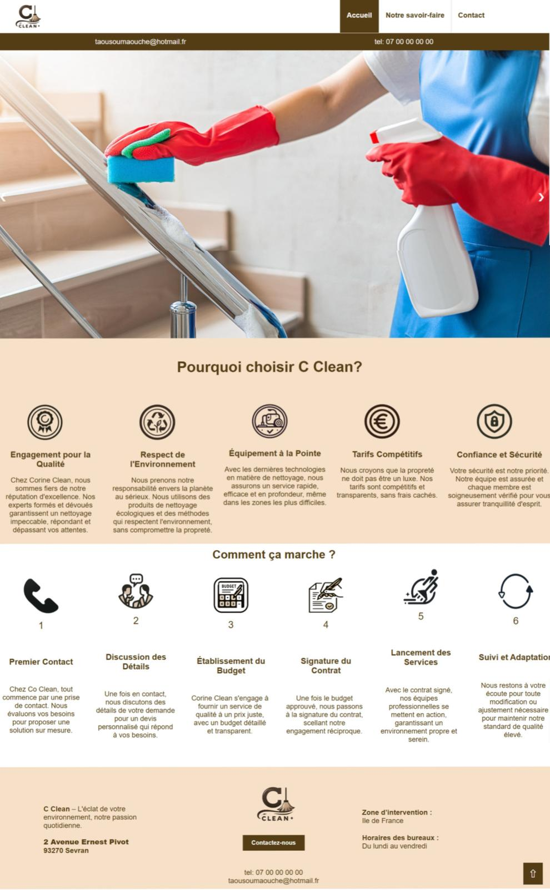

---

# 🧼 **Page de Présentation – C Clean**
## Description  
Projet HTML/CSS réalisé à titre personnel pour mettre en page un site vitrine de services de nettoyage.  
Cette page présente les services, les engagements et le processus de travail de l’entreprise fictive **C Clean**, dans un design clair et professionnel.

---

## Aperçu  


---

## Fonctionnalités  
- Mise en page moderne avec HTML5 et CSS3  
- Section "Pourquoi nous choisir" avec icônes et explications  
- Présentation du déroulement des services en 6 étapes  
- Pied de page complet avec coordonnées et informations pratiques  
- Responsive simple pour s'adapter à différents écrans

---

## Installation  
1. Clonez ce dépôt :  
```bash
git clone https://github.com/ton-pseudo/front_end_html_css.git
cd front_end_html_css
```
2. Ouvrez `c_clean.html` dans votre navigateur pour voir la page.

---

## Auteur  
Créé par **Oumaouche Taous**.  
Travail personnel réalisé pour pratiquer HTML et CSS.

---

## Licence  
Projet libre à des fins personnelles, d'apprentissage ou de démonstration.

---